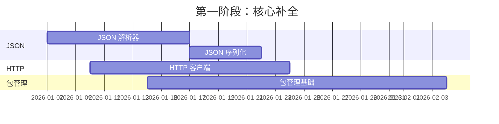

# Sola 语言评估报告

> **评估日期**: 2026-01-06
> **版本**: v0.2.0
> **评估范围**: 核心语言特性、标准库、工具链、生态系统

---

## 📋 目录

1. [执行摘要](#执行摘要)
2. [语言概述](#语言概述)
3. [核心架构评估](#核心架构评估)
4. [类型系统深度分析](#类型系统深度分析)
5. [语言特性评估](#语言特性评估)
6. [标准库评估](#标准库评估)
7. [运行时与性能](#运行时与性能)
8. [与主流语言对比](#与主流语言对比)
9. [缺失功能分析](#缺失功能分析)
10. [生产就绪度评估](#生产就绪度评估)
11. [发展路线图](#发展路线图)
12. [总结与评分](#总结与评分)

---

## 执行摘要

### 一句话评价

**Sola 是一门语法优雅、功能完备的渐进式类型语言，具备完整的 OOP 支持和扎实的标准库基础，距离生产级别还需完善类型系统和关键库。**

### 核心指标速览

| 维度 | 完成度 | 状态 |
|------|--------|------|
| **编译器基础设施** | 100% | ✅ 生产就绪 |
| **虚拟机与运行时** | 98% | ✅ 生产就绪 |
| **类型系统** | 55% | 🟡 需要增强 |
| **面向对象编程** | 100% | ✅ 生产就绪 |
| **标准库** | 72% | 🟡 需要补充 |
| **工具链** | 35% | 🔴 需要建设 |
| **生态系统** | 15% | 🔴 初期阶段 |

**综合完成度**: **69%** (Alpha 阶段)

---

## 语言概述

### 设计哲学

Sola 是一门**编译型渐进式类型语言**，设计目标是结合 PHP 的语法亲和力与现代静态类型语言的安全性。

```sola
namespace myapp.controllers

use sola.io.Console;
use sola.net.tcp.TcpServer;

public class Application {

    public static function main(): void {
        $server := new TcpServer("0.0.0.0", 8080);
        Console::info("服务器启动于 " + $server->getAddress());
    }
}
```

### 核心特点

| 特性 | 描述 |
|------|------|
| **语法风格** | PHP 风格 (`$` 变量、`->` 成员访问、`::` 静态访问) |
| **类型系统** | 渐进式类型 (可选类型注解 + 运行时检查) |
| **执行方式** | 编译到字节码，运行于自定义 VM |
| **内存管理** | 三色标记清除 GC |
| **并发模型** | 当前为单线程 (协程计划中) |

---

## 核心架构评估

### 1. 编译管线

```
┌─────────┐    ┌────────┐    ┌─────┐    ┌───────────┐    ┌──────────┐
│ 源代码  │ -> │ Lexer  │ -> │ AST │ -> │ Compiler  │ -> │ Bytecode │
└─────────┘    └────────┘    └─────┘    └───────────┘    └──────────┘
                  词法          语法         编译             字节码
                  分析          分析         生成             输出
```

| 组件 | 完成度 | 技术细节 |
|------|--------|----------|
| **词法分析器 (Lexer)** | ✅ 100% | 支持所有关键字、运算符、字面量、Unicode 字符串 |
| **语法分析器 (Parser)** | ✅ 100% | 递归下降解析，完整的 AST 节点类型 (~60 种) |
| **编译器 (Compiler)** | ✅ 100% | 多遍编译，符号表支持，类型推导基础 |
| **字节码指令集** | ✅ 100% | 70+ 条指令，覆盖所有语言特性 |

### 2. 字节码指令集统计

| 类别 | 指令数 | 示例 |
|------|--------|------|
| 栈操作 | 4 | `OpPush`, `OpPop`, `OpDup`, `OpSwap` |
| 变量操作 | 4 | `OpLoadLocal`, `OpStoreLocal`, `OpLoadGlobal`, `OpStoreGlobal` |
| 算术/逻辑 | 18 | `OpAdd`, `OpMul`, `OpEq`, `OpAnd`, `OpBitXor` |
| 控制流 | 5 | `OpJump`, `OpJumpIfFalse`, `OpLoop`, `OpCall`, `OpReturn` |
| 对象操作 | 6 | `OpNewObject`, `OpGetField`, `OpSetField`, `OpCallMethod` |
| 数组/Map | 12 | `OpNewArray`, `OpArrayGet`, `OpNewMap`, `OpMapSet` |
| 异常处理 | 7 | `OpThrow`, `OpEnterTry`, `OpEnterCatch`, `OpEnterFinally` |
| 类型操作 | 3 | `OpCheckType`, `OpCast`, `OpCastSafe` |

### 3. 虚拟机架构

```go
type VM struct {
    frames     [64]CallFrame    // 调用栈 (最大深度 64)
    stack      [256]Value       // 操作数栈 (最大深度 256)
    globals    map[string]Value // 全局变量表
    classes    map[string]*Class // 类注册表
    gc         *GC              // 垃圾回收器
    tryStack   []TryContext     // 异常处理栈
}
```

| 配置 | 值 | 说明 |
|------|-----|------|
| 操作数栈深度 | 256 | 满足绝大多数场景 |
| 调用栈深度 | 64 | 支持递归，防止栈溢出 |
| 指令执行上限 | 1000万 | 防止无限循环 |
| GC 检查间隔 | 500 条指令 | 平衡性能与内存回收 |

---

## 类型系统深度分析

### 当前定位：渐进式类型语言

Sola 的类型系统介于纯动态语言 (Python) 和纯静态语言 (Go/Rust) 之间，更接近 TypeScript 或 PHP 8.x。

### 已实现的类型特性

| 特性 | 状态 | 语法示例 |
|------|------|----------|
| **显式类型声明** | ✅ 已实现 | `int $count = 10;` |
| **类型推断** | ✅ 已实现 | `$name := "hello";` |
| **函数参数类型** | ✅ 已实现 | `function add(int $a, int $b)` |
| **返回类型声明** | ✅ 已实现 | `function get(): string` |
| **可空类型** | ✅ 已实现 | `?string $nullable = null;` |
| **数组类型** | ✅ 已实现 | `int[] $nums`, `string[100] $fixed` |
| **Map 类型** | ✅ 已实现 | `map[string]int $scores` |
| **多返回值** | ✅ 已实现 | `function split(): (int, string)` |

### 支持的基础类型

| 类别 | 类型 | 说明 |
|------|------|------|
| **整数** | `int`, `i8`, `i16`, `i32`, `i64` | 有符号整数 |
| **无符号整数** | `uint`, `u8`, `u16`, `u32`, `u64` | 无符号整数 |
| **浮点数** | `float`, `f32`, `f64` | 浮点类型 |
| **基础类型** | `bool`, `string`, `void`, `null` | 通用类型 |
| **复合类型** | `object`, `func`, `Type[]`, `map[K]V` | 引用类型 |

### 类型系统的核心问题

#### 问题 1: 类型检查主要在运行时

```sola
int $x = 10;
$x = "hello";  // 编译期不报错，运行时抛出 InvalidCastException
```

当前实现通过 `OpCheckType` 指令在运行时进行类型检查，而非编译期阻止。

#### 问题 2: 类型推导不完整

```go
// compiler.go 中的类型推导函数
func (c *Compiler) inferExprType(expr ast.Expression) string {
    switch e := expr.(type) {
    case *ast.IntegerLiteral:
        return "int"
    case *ast.CallExpr, *ast.MethodCall:
        return "unknown"  // 函数返回类型无法推导
    default:
        return "unknown"
    }
}
```

当表达式类型为 `unknown` 时，类型检查被延迟到运行时。

### 类型系统成熟度评估

| 维度 | 评分 | 说明 |
|------|------|------|
| 语法完整性 | ⭐⭐⭐⭐☆ | 类型注解语法丰富 |
| 编译期检查 | ⭐⭐☆☆☆ | 大部分检查在运行时 |
| 类型推导 | ⭐⭐☆☆☆ | 仅支持字面量和简单表达式 |
| 类型安全性 | ⭐⭐☆☆☆ | 编译通过不代表类型安全 |
| 泛型支持 | ⭐☆☆☆☆ | 完全未实现 |

**类型系统完成度**: **55%**

---

## 语言特性评估

### 1. 面向对象编程 (100%)

| 特性 | 状态 | 说明 |
|------|------|------|
| **类定义** | ✅ | `class`, `abstract class`, `interface` |
| **访问控制** | ✅ | `public`, `protected`, `private` |
| **继承** | ✅ | `extends` 单继承，`parent::` 父类调用 |
| **接口实现** | ✅ | `implements` 多接口实现 |
| **构造/析构** | ✅ | `__construct()`, `__destruct()` |
| **静态成员** | ✅ | `static` 属性和方法，类常量 `const` |
| **方法重载** | ✅ | 同名不同参数数量 |
| **枚举** | ✅ | `enum` 完整支持 |
| **注解** | ✅ | `@Annotation` 语法，运行时反射 |

```sola
public class User extends Model implements Serializable {
    public const string TABLE = "users";
    private static int $count = 0;

    public string $name;
    public ?int $age = null;

    public function __construct(string $name) {
        $this->name = $name;
        self::$count++;
    }

    @Override
    public function serialize(): string {
        return #"{\"name\": \"{$this->name}\"}";
    }
}
```

### 2. 函数与闭包 (100%)

| 特性 | 状态 | 语法 |
|------|------|------|
| **普通函数** | ✅ | `function name() {}` |
| **闭包** | ✅ | `$fn = function() {}` |
| **变量捕获** | ✅ | `use ($var)` 显式捕获 |
| **箭头函数** | ✅ | `(args) => expr` 自动捕获 |
| **默认参数** | ✅ | `function f(int $a = 10)` |
| **可变参数** | ✅ | `function f(...$args)` |
| **多返回值** | ✅ | `return $a, $b;` |

```sola
// 闭包与箭头函数
$multiplier := 3;
$fn := function(int $x) use ($multiplier): int {
    return $x * $multiplier;
};

$arrow := (int $x): int => $x * $multiplier;  // 自动捕获

$a, $b := getCoordinates();  // 多返回值接收
```

### 3. 控制流 (95%)

| 特性 | 状态 | 说明 |
|------|------|------|
| **条件语句** | ✅ | `if/elseif/else` |
| **循环语句** | ✅ | `for`, `while`, `foreach` |
| **分支语句** | ✅ | `switch/case/default` (自动 break) |
| **跳转控制** | ✅ | `break`, `continue`, `return` |
| **标签跳转** | ❌ | 不支持 `goto` 或标签 break |

### 4. 异常处理 (100%)

完整的 Java 风格异常系统：

```sola
try {
    $result := riskyOperation();
} catch (IOException $e) {
    Console::error("IO错误: " + $e->getMessage());
} catch (Exception $e) {
    Console::error("未知错误: " + $e->getMessage());
} finally {
    cleanup();
}
```

**异常类层次结构**:
```
Throwable
├── Error (不可恢复错误)
└── Exception (可捕获异常)
    ├── RuntimeException
    │   ├── NullReferenceException
    │   ├── DivideByZeroException
    │   ├── ArrayIndexOutOfBoundsException
    │   └── ...
    ├── IOException
    ├── ArgumentException
    └── ...
```

### 5. 数据结构 (100%)

| 结构 | 语法 | 操作 |
|------|------|------|
| **动态数组** | `int[] $arr = [1,2,3]` | 索引、追加、长度、迭代 |
| **定长数组** | `string[100] $fixed` | 固定容量，索引访问 |
| **Map** | `map[string]int $m` | 键值对、存在检查、迭代 |
| **万能数组** | `SuperArray` | PHP 风格混合键数组 |

### 6. 运算符 (95%)

| 类别 | 运算符 | 状态 |
|------|--------|------|
| 算术 | `+`, `-`, `*`, `/`, `%` | ✅ |
| 比较 | `==`, `!=`, `<`, `>`, `<=`, `>=` | ✅ |
| 逻辑 | `&&`, `\|\|`, `!` | ✅ |
| 位运算 | `&`, `\|`, `^`, `~`, `<<`, `>>` | ✅ |
| 赋值 | `=`, `+=`, `-=`, `*=`, `/=`, `%=` | ✅ |
| 自增/减 | `++`, `--` (前缀/后缀) | ✅ |
| 三元 | `? :` | ✅ |
| 空值合并 | `??` | ❌ 未实现 |

---

## 标准库评估

### 库完成度总览

| 库 | 包名 | 完成度 | 核心类/功能 |
|----|------|--------|-------------|
| **核心语言** | `sola.lang` | ✅ 100% | `Str`, `Bytes`, `SuperArray`, 异常类 |
| **I/O** | `sola.io` | ✅ 100% | `Console`, `File`, `Dir`, `Stream` |
| **时间** | `sola.time` | ✅ 100% | `Time`, `DateTime`, `Carbon`, `Duration` |
| **正则** | `sola.regex` | ✅ 100% | `Regex`, `Match`, `RegexOptions` |
| **数学** | `sola.math` | ✅ 100% | `Math` (abs, min, max, sin, cos, sqrt...) |
| **编码** | `sola.util` | ✅ 100% | `Base64` (标准/URL 安全/严格模式) |
| **TCP** | `sola.net.tcp` | ✅ 100% | `TcpClient`, `TcpServer`, `TcpConnection` |
| **TLS** | `sola.net.tcp` | ✅ 100% | `TlsClient`, `TlsServer` |
| **Redis** | `sola.data` | ✅ 100% | `Redis` (RESP 协议完整实现) |
| **HTTP** | `sola.net.http` | ❌ 0% | 未实现 |
| **JSON** | `sola.json` | ❌ 0% | 未实现 |
| **数据库** | `sola.data` | 🟡 33% | 仅 Redis，无 MySQL/PostgreSQL |

### 详细库评估

#### 1. 核心语言库 `sola.lang` (100%)

**Str 类** - 50+ 字符串方法:
```sola
use sola.lang.Str;

$s := "  Hello World  ";
Str::trim($s);           // "Hello World"
Str::toUpper($s);        // "  HELLO WORLD  "
Str::split($s, " ");     // ["", "", "Hello", "World", "", ""]
Str::contains($s, "o");  // true
Str::replace($s, "o", "0"); // "  Hell0 W0rld  "
```

**Bytes 类** - 字节操作:
```sola
use sola.lang.Bytes;

$data := Bytes::fromString("Hello");
$hex := Bytes::toHex($data);    // "48656c6c6f"
$back := Bytes::fromHex($hex);  // [72, 101, 108, 108, 111]
```

**异常类** - 13 个预定义异常类:
- `Exception`, `RuntimeException`, `Error`
- `NullReferenceException`, `ArgumentException`
- `DivideByZeroException`, `ArrayIndexOutOfBoundsException`
- `InvalidCastException`, `FormatException`
- 等等...

#### 2. I/O 库 `sola.io` (100%)

```sola
use sola.io.{Console, File, Dir};

// 控制台输出
Console::info("信息");
Console::warn("警告");
Console::error("错误");

// 文件操作
$content := File::read("data.txt");
File::write("output.txt", $content);
File::copy("src.txt", "dst.txt");

// 目录操作
Dir::create("new_folder");
$files := Dir::list(".");
Dir::remove("old_folder");
```

#### 3. 时间库 `sola.time` (100%)

```sola
use sola.time.{Time, DateTime, Carbon, Stopwatch};

// 基础时间
Time::sleep(1000);  // 休眠 1 秒
$ts := Time::now(); // 当前时间戳

// DateTime
$dt := DateTime::now();
$formatted := $dt->format("Y-m-d H:i:s");

// Carbon (链式调用)
$future := Carbon::now()
    ->addDays(7)
    ->addHours(3)
    ->startOfDay();

// 性能计时
$sw := new Stopwatch();
$sw->start();
// ... 执行代码 ...
$elapsed := $sw->elapsedMs();
```

#### 4. 网络库 `sola.net` (62%)

**TCP/TLS 完整实现**:
```sola
use sola.net.tcp.{TcpServer, TcpClient, TcpConnection};
use sola.net.tcp.{TlsClient, TlsServer};

// TCP 服务器
$server := new TcpServer("0.0.0.0", 8080);
while ($server->isListening()) {
    $conn := $server->accept();
    $data := $conn->readLine();
    $conn->write("Echo: " + $data);
    $conn->close();
}

// TLS 安全连接
$client := new TlsClient();
$client->connect("example.com", 443);
$client->write("GET / HTTP/1.1\r\nHost: example.com\r\n\r\n");
$response := $client->read(4096);
```

**缺失**: HTTP、UDP、WebSocket

#### 5. 数据库 `sola.data` (33%)

```sola
use sola.data.Redis;

$redis := new Redis("127.0.0.1", 6379);
$redis->set("key", "value");
$value := $redis->get("key");
$redis->expire("key", 3600);
```

**缺失**: MySQL, PostgreSQL, SQLite

### Native 运行时函数

底层由 Go 实现的原生函数:

| 文件 | 功能 | 函数数量 |
|------|------|----------|
| `native_string.go` | 字符串操作 | 20+ |
| `native_file.go` | 文件系统 | 15+ |
| `native_tcp.go` | TCP/TLS 网络 | 25+ |
| `native_time.go` | 时间操作 | 10+ |
| `native_regex.go` | 正则表达式 | 8+ |
| `native_bytes.go` | 字节数组 | 10+ |
| `native_base64.go` | Base64 编解码 | 6+ |
| `builtin_core.go` | 核心函数 | 15+ |
| `builtin_math.go` | 数学函数 | 20+ |
| `builtin_reflect.go` | 反射 | 5+ |

---

## 运行时与性能

### 垃圾回收器

Sola 使用**三色标记清除**算法进行自动内存管理：

```go
type GCColor byte
const (
    GCWhite GCColor = iota  // 未访问（待回收）
    GCGray                   // 已发现但子对象未扫描
    GCBlack                  // 已扫描完成（存活）
)
```

| 配置项 | 默认值 | 说明 |
|--------|--------|------|
| 初始阈值 | 32 对象 | 超过后触发 GC |
| 检查间隔 | 16 次分配 | 分配次数检查 |
| 动态调整 | ✅ | 根据存活率自动调整阈值 |
| 调试模式 | 可选 | 输出 GC 详情 |

**GC API**:
```sola
// 手动控制 (通过 VM 配置)
vm.SetGCEnabled(true);
vm.SetGCThreshold(100);
vm.CollectGarbage();  // 手动触发
```

### 性能特性

| 特性 | 状态 | 说明 |
|------|------|------|
| 字节码执行 | ✅ | 比解释执行快 |
| 热点优化 | ❌ | 无 JIT 编译 |
| 内联缓存 | ❌ | 方法调用无优化 |
| 并发 GC | ❌ | Stop-the-world 回收 |

### 性能优化建议

1. **避免创建临时对象** - 减少 GC 压力
2. **使用定长数组** - 避免动态扩容
3. **复用对象** - 对象池模式
4. **控制递归深度** - 最大 64 层调用栈

---

## 与主流语言对比

### 特性矩阵

| 特性 | Sola | Go | Java | C# | PHP 8 | TypeScript |
|------|------|-----|------|-----|-------|------------|
| 静态类型 | 🟡 | ✅ | ✅ | ✅ | 🟡 | ✅ |
| 类型推断 | 🟡 | ✅ | 🟡 | ✅ | 🟡 | ✅ |
| 泛型 | ❌ | ✅ | ✅ | ✅ | ❌ | ✅ |
| 异常处理 | ✅ | ❌ | ✅ | ✅ | ✅ | ✅ |
| OOP | ✅ | 🟡 | ✅ | ✅ | ✅ | ✅ |
| 协程 | ❌ | ✅ | 🟡 | ✅ | ❌ | ✅ |
| GC | ✅ | ✅ | ✅ | ✅ | ✅ | ✅ |
| 包管理 | ❌ | ✅ | ✅ | ✅ | ✅ | ✅ |

### 语法相似度

| 语言 | 相似度 | 主要相似点 |
|------|--------|------------|
| **PHP** | 85% | 变量前缀 `$`，成员访问 `->`，静态 `::` |
| **Java** | 60% | 类定义，访问控制，注解语法 |
| **C#** | 55% | 入口类设计，属性语法 |
| **Go** | 40% | `:=` 类型推断，多返回值 |
| **TypeScript** | 45% | 渐进式类型，类型注解 |

---

## 缺失功能分析

### 🔴 高优先级 (生产阻塞)

| 功能 | 重要性 | 工作量 | 说明 |
|------|--------|--------|------|
| **JSON 库** | 🔴🔴🔴 | 2-3 周 | Web 开发必备 |
| **HTTP 客户端/服务器** | 🔴🔴🔴 | 3-4 周 | 网络应用基础 |
| **包管理工具** | 🔴🔴🔴 | 4-6 周 | 依赖管理，版本控制 |
| **数据库驱动** | 🔴🔴 | 4-6 周 | MySQL/PostgreSQL |
| **编译期类型检查** | 🔴🔴 | 4-6 周 | 完善类型系统 |

### 🟡 中优先级 (增强功能)

| 功能 | 重要性 | 工作量 | 说明 |
|------|--------|--------|------|
| **泛型系统** | 🟡🟡🟡 | 6-8 周 | 类型安全的代码复用 |
| **async/await** | 🟡🟡🟡 | 6-8 周 | 异步编程模型 |
| **加密/哈希库** | 🟡🟡 | 2-3 周 | 安全功能 |
| **环境变量** | 🟡 | 1 周 | 配置管理 |
| **空值合并 `??`** | 🟡 | 0.5 周 | 语法便利性 |
| **LSP 服务器** | 🟡🟡 | 4-6 周 | IDE 支持 |
| **调试器** | 🟡🟡 | 6-8 周 | 开发体验 |

### 🟢 低优先级 (锦上添花)

| 功能 | 工作量 | 说明 |
|------|--------|------|
| 集合类型 (Set, Queue) | 2-3 周 | 更多数据结构 |
| 大数运算 | 2 周 | BigInt, BigDecimal |
| 操作符重载 | 2 周 | 语法糖 |
| Traits/Mixins | 3-4 周 | 代码复用 |
| 模式匹配 | 3-4 周 | 更强大的 switch |

---

## 生产就绪度评估

### 当前阶段: Alpha (69%)

```
[====================================----------] 69%
                    Alpha            Beta     RC    1.0
```

### 版本里程碑

| 版本 | 目标完成度 | 预估时间 | 关键交付物 |
|------|-----------|----------|------------|
| **当前 (Alpha)** | 69% | - | 核心功能完整，TCP/TLS/Redis |
| **Beta** | 80% | +4-5 周 | JSON、HTTP 客户端、包管理基础 |
| **RC** | 90% | +6-8 周 | HTTP 服务器、数据库驱动、调试器 |
| **1.0 GA** | 95%+ | +8-12 周 | 完整文档、性能优化、安全审计 |

**预计总时间**: 18-25 周 (约 4.5-6 个月)

### 关键瓶颈

1. **标准库缺口**
   - JSON、HTTP 是 Web 开发基础设施
   - 缺失将严重限制使用场景

2. **工具链不完善**
   - 无包管理器 → 依赖管理困难
   - 无调试器 → 问题定位困难
   - 无 LSP → IDE 体验差

3. **类型系统不完整**
   - 编译期检查不足
   - 无泛型 → 代码复用受限

4. **生态空白**
   - 无第三方库
   - 无社区支持
   - 文档不完善

---

## 发展路线图

### 第一阶段: 核心补全 (4-6 周)

**目标**: 达到 Beta 版本 (80%)



**交付物**:
- ✅ `sola.json.Json` - 完整的 JSON 编解码
- ✅ `sola.net.http.HttpClient` - HTTP 请求支持
- ✅ `sola pkg` 命令 - 基础包管理

### 第二阶段: 功能增强 (6-8 周)

**目标**: 达到 RC 版本 (90%)

**交付物**:
- ✅ HTTP 服务器框架
- ✅ MySQL/PostgreSQL 驱动
- ✅ 加密/哈希库
- ✅ 环境变量和配置管理
- ✅ 基础调试器

### 第三阶段: 生产化 (8-12 周)

**目标**: 达到 1.0 GA (95%+)

**交付物**:
- ✅ 完整的语言文档和教程
- ✅ 性能基准测试和优化
- ✅ 安全性审计
- ✅ LSP 服务器 (IDE 支持)
- 🟡 泛型系统 (可选)
- 🟡 协程支持 (可选)

### 长期愿景

```
1.x 系列:
├── 1.0 - 生产就绪 (2026 Q2)
├── 1.1 - 泛型系统 (2026 Q3)
├── 1.2 - 协程/异步 (2026 Q4)
└── 1.3 - 性能优化 (JIT 探索)

2.x 系列:
├── 宏系统
├── 编译时计算
└── 原生编译探索
```

---

## 总结与评分

### 综合评分

| 维度 | 分数 | 说明 |
|------|------|------|
| **语法设计** | ⭐⭐⭐⭐⭐ (5/5) | 优雅、熟悉、学习曲线平缓 |
| **编译器实现** | ⭐⭐⭐⭐⭐ (5/5) | Lexer/Parser/Compiler 完善 |
| **虚拟机** | ⭐⭐⭐⭐⭐ (5/5) | 稳定、功能完整、GC 可用 |
| **类型系统** | ⭐⭐⭐☆☆ (3/5) | 语法完整，语义需增强 |
| **标准库** | ⭐⭐⭐⭐☆ (4/5) | 基础扎实，关键库缺失 |
| **工具链** | ⭐⭐☆☆☆ (2/5) | 急需包管理和调试器 |
| **文档生态** | ⭐⭐☆☆☆ (2/5) | 需要大量完善 |

### 最终评估

**综合完成度**: ⭐⭐⭐⭐☆ (3.7/5) — **69%**

### 核心优势

1. ✅ **语法亲和力高** - PHP 开发者可快速上手
2. ✅ **OOP 支持完整** - 类、继承、接口、抽象类、枚举、注解
3. ✅ **运行时稳定** - 成熟的 VM 和 GC 实现
4. ✅ **网络功能完善** - TCP/TLS 全支持，Redis 客户端
5. ✅ **异常处理健壮** - 完整的异常类层次结构
6. ✅ **基础库扎实** - 字符串、时间、正则、文件 I/O

### 主要差距

1. 🔴 **类型系统是渐进式** - 非严格静态，编译期检查不完整
2. 🔴 **关键库缺失** - JSON、HTTP 是 Web 开发刚需
3. 🔴 **无包管理** - 依赖管理困难
4. 🟡 **无泛型** - 代码复用受限
5. 🟡 **无异步支持** - 高并发场景受限
6. 🟡 **工具链薄弱** - 无调试器、无 IDE 插件

### 适用场景

| 场景 | 适用性 | 说明 |
|------|--------|------|
| 学习/教学 | ⭐⭐⭐⭐⭐ | 语法清晰，概念完整 |
| 脚本/工具 | ⭐⭐⭐⭐☆ | 基础库足够 |
| TCP 服务 | ⭐⭐⭐⭐☆ | 完整的 TCP/TLS 支持 |
| Web 后端 | ⭐⭐☆☆☆ | 缺 HTTP/JSON |
| 生产系统 | ⭐⭐☆☆☆ | 工具链和生态不足 |

### 发展建议

**短期 (1-2 个月)**:
1. 🔴 实现 JSON 库 — Web 开发基础
2. 🔴 实现 HTTP 客户端 — 网络请求能力
3. 🔴 开发包管理工具 — 依赖管理

**中期 (3-4 个月)**:
1. 🔴 完善编译期类型检查
2. 🟡 HTTP 服务器框架
3. 🟡 数据库驱动

**长期 (6+ 个月)**:
1. 🟡 泛型系统
2. 🟡 协程/异步
3. 🟡 LSP + 调试器
4. 🟢 生态建设

---

**报告结束**

*本报告基于 Sola 语言代码库的全面分析*
*评估日期: 2026-01-06*
*评估版本: v0.2.0*
w
