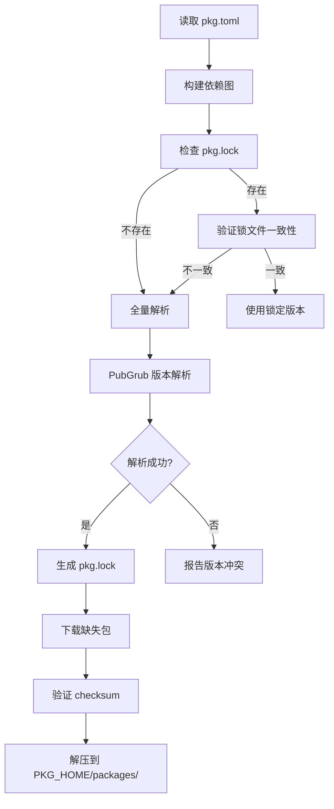

# 包管理机制设计方案

## 1. 设计概述

设计一套现代化的包管理系统，参考 Cargo (Rust)、Go modules 和 npm 的最佳实践，提供：

- 中央包注册中心（支持自定义镜像）
- 语义化版本控制
- 可重复构建 (lockfile)
- 工作空间支持 (monorepo)
- 灵活的项目结构

---

## 2. 配置文件设计 (pkg.toml)

配置文件命名为 `pkg.toml`，与语言名称解耦，便于未来品牌调整。

```toml
[package]
name = "my-app"
version = "1.0.0"
description = "A sample application"
authors = ["Author Name <author@example.com>"]
license = "MIT"
repository = "https://github.com/user/my-app"
homepage = "https://my-app.example.com"
keywords = ["web", "api", "http"]
readme = "README.md"
edition = "2026"                    # 语言版本

# 入口文件配置（可选，默认自动检测）
entry = "main.sola"                 # 可执行程序入口
lib = "lib.sola"                    # 库入口

[dependencies]
http = "^2.0.0"                     # 从注册中心获取
json = { version = "1.5", features = ["pretty"] }
utils = { git = "https://github.com/org/utils", tag = "v1.0" }
local-lib = { path = "../my-lib" }

[dev-dependencies]
test-utils = "1.0.0"
benchmark = { version = "0.5", optional = true }

[build-dependencies]
codegen = "1.0.0"

[features]
default = ["json"]
full = ["http", "json", "crypto"]
crypto = ["dep:crypto-lib"]

[workspace]
members = ["packages/*", "crates/core"]
exclude = ["packages/deprecated"]
```

---

## 3. 项目结构规范

### 3.1 灵活的目录结构

**不强制要求 `src/` 目录**，`pkg.toml` 可以与源码文件在同一级：

```javascript
# 方式1: 简单项目（推荐小型项目）
my-app/
├── pkg.toml
├── main.sola           # 入口文件，与配置同级
├── utils.sola
└── README.md

# 方式2: 标准项目（推荐中大型项目）
my-app/
├── pkg.toml
├── src/
│   ├── main.sola       # 程序入口
│   └── lib.sola        # 库入口
├── examples/
├── tests/
└── README.md

# 方式3: 纯库项目
my-lib/
├── pkg.toml
├── lib.sola            # 库入口（单文件库）
└── README.md
```


### 3.2 入口文件自动检测规则

按优先级查找入口文件：

```javascript
可执行程序入口:
    1. pkg.toml 中 entry 字段指定的文件
    2. main.sola (根目录)
    3. src/main.sola

库入口:
    1. pkg.toml 中 lib 字段指定的文件
    2. lib.sola (根目录)
    3. src/lib.sola
```


### 3.3 包命名规范

```javascript
包名格式: [scope/]name
- scope: 可选的组织/用户命名空间 (如 @official, @company)
- name: 包名，只允许小写字母、数字、连字符

示例:
  http                  # 公共包
  @official/collections # 官方包
  @myorg/utils          # 组织私有包
```

---

## 4. 本地存储与环境变量

### 4.1 环境变量

类似 Go 的 `GOPATH` 和 `GOMODCACHE`，使用环境变量控制本地存储位置：| 环境变量 | 说明 | 默认值 |

|---------|------|--------|

| `PKG_HOME` | 包管理器主目录 | Windows: `%LOCALAPPDATA%\pkg`<br>Linux/macOS: `~/.pkg` |

| `PKG_CACHE` | 下载缓存目录 | `$PKG_HOME/cache` |

| `PKG_REGISTRY` | 默认注册中心 URL | `https://pkg.example.org` |

### 4.2 本地目录结构

```javascript
$PKG_HOME/
├── cache/                      # 下载缓存 ($PKG_CACHE)
│   └── registry/
│       └── pkg.example.org/
│           └── http/
│               ├── 2.0.0.tar.gz
│               └── 2.1.0.tar.gz
├── packages/                   # 解压后的包（全局共享）
│   └── http@2.1.0/
│       ├── pkg.toml
│       ├── lib.sola
│       └── ...
├── bin/                        # 全局安装的可执行文件
├── credentials.toml            # 认证信息（加密存储）
└── config.toml                 # 全局配置
```


### 4.3 全局配置文件 ($PKG_HOME/config.toml)

```toml
# 默认注册中心
[registry]
default = "https://pkg.example.org"

# 镜像配置
[registry.mirrors]
# 配置镜像源（优先级从上到下）
"https://pkg.example.org" = [
    "https://mirror.cn.example.org",      # 中国镜像
    "https://mirror.eu.example.org",      # 欧洲镜像
]

# 私有注册中心
[registry.private]
"@mycompany" = "https://pkg.mycompany.com"

# 代理设置
[net]
proxy = "http://proxy.example.com:8080"
timeout = 30  # 秒

# 其他设置
[build]
jobs = 4      # 并行编译任务数
```

---

## 5. 镜像与注册中心

### 5.1 镜像支持

```bash
# 命令行配置镜像
sola config set registry.mirrors.default "https://mirror.cn.example.org"

# 或直接编辑 $PKG_HOME/config.toml

# 临时使用镜像
PKG_REGISTRY=https://mirror.cn.example.org sola add http

# 查看当前配置
sola config list
```


### 5.2 多注册中心支持

```toml
# pkg.toml 中可以指定包来源
[dependencies]
# 从默认注册中心
http = "^2.0.0"

# 从指定注册中心
internal-lib = { version = "1.0", registry = "https://pkg.mycompany.com" }

# 从私有 scope（自动路由到对应注册中心）
"@mycompany/utils" = "^1.0.0"
```


### 5.3 注册中心优先级

```javascript
1. pkg.toml 中显式指定的 registry
2. 私有 scope 对应的注册中心 (registry.private)
3. 镜像源 (registry.mirrors)
4. 默认注册中心 (registry.default)
```

---

## 6. 版本管理

### 6.1 语义化版本 (SemVer)

```javascript
MAJOR.MINOR.PATCH[-PRERELEASE][+BUILD]

示例:
  1.0.0
  2.1.3-alpha.1
  1.0.0-beta+build.123
```


### 6.2 版本约束语法

```toml
[dependencies]
# 精确版本
exact = "=1.0.0"

# 兼容版本 (^) - 默认，允许向后兼容的更新
compat = "^1.2.3"     # >=1.2.3 <2.0.0
compat2 = "^0.2.3"    # >=0.2.3 <0.3.0 (0.x 特殊处理)

# 波浪号 (~) - 允许 patch 级更新
tilde = "~1.2.3"      # >=1.2.3 <1.3.0

# 范围
range = ">=1.0, <2.0"
range2 = "1.0 - 2.0"  # 等价于 >=1.0.0 <=2.0.0

# 通配符
wildcard = "1.*"      # >=1.0.0 <2.0.0
wildcard2 = "1.2.*"   # >=1.2.0 <1.3.0

# 最新版本
latest = "*"
```

---

## 7. 锁文件设计 (pkg.lock)

```toml
# This file is auto-generated. Do not edit manually.
version = 1
generated = "2026-01-07T12:00:00Z"

[[package]]
name = "http"
version = "2.1.0"
source = "registry+https://pkg.example.org"
checksum = "sha256:abc123def456..."
dependencies = ["encoding", "net"]

[[package]]
name = "utils"
version = "1.0.0"
source = "git+https://github.com/org/utils?tag=v1.0#commit=abc123"
checksum = "sha256:789xyz..."

[[package]]
name = "local-lib"
version = "0.1.0"
source = "path+../my-lib"
# 本地路径依赖不记录 checksum
```

---

## 8. CLI 命令设计

### 8.1 项目管理

```bash
# 创建新项目
sola new my-app [--lib|--bin]

# 初始化现有目录
sola init [--name <name>]

# 构建项目
sola build [--release]

# 运行项目
sola run [<file>] [-- args...]

# 清理构建产物
sola clean
```


### 8.2 依赖管理

```bash
# 添加依赖
sola add <package>[@version]
sola add <package> --git <url> [--tag|--branch|--rev]
sola add <package> --path <path>
sola add <package> --dev           # 开发依赖
sola add <package> --features f1,f2
sola add <package> --registry <url>

# 移除依赖
sola remove <package>

# 更新依赖
sola update                        # 更新所有
sola update <package>              # 更新指定包
sola update --compatible           # 仅兼容更新

# 安装依赖（根据 pkg.lock）
sola install

# 查看依赖树
sola tree [--depth <n>]
sola tree --duplicates

# 检查过时依赖
sola outdated
```


### 8.3 配置管理

```bash
# 查看配置
sola config list
sola config get <key>

# 设置配置
sola config set <key> <value>

# 设置镜像
sola config set registry.mirrors.default "https://mirror.example.org"
```


### 8.4 包发布

```bash
# 登录注册中心
sola login [--registry <url>]

# 发布包
sola publish [--dry-run] [--registry <url>]

# 撤回版本 (不可恢复)
sola yank <version>

# 搜索包
sola search <query>

# 查看包信息
sola info <package>
```

---

## 9. 中央注册中心 API

### 9.1 REST API 设计

```yaml
# 包信息
GET  /api/v1/packages/{name}
GET  /api/v1/packages/{name}/versions
GET  /api/v1/packages/{name}/{version}

# 下载（支持 HEAD 请求检查是否存在）
GET  /api/v1/packages/{name}/{version}/download
HEAD /api/v1/packages/{name}/{version}/download

# 发布
PUT  /api/v1/packages/{name}/{version}
     Headers: Authorization: Bearer <token>
     Body: multipart/form-data (tarball + metadata.json)

# 撤回
DELETE /api/v1/packages/{name}/{version}
       Headers: Authorization: Bearer <token>

# 搜索
GET  /api/v1/search?q={query}&page={n}&per_page={n}&sort={downloads|recent}

# 用户认证
POST   /api/v1/auth/login
POST   /api/v1/auth/token
GET    /api/v1/auth/tokens
DELETE /api/v1/auth/token/{id}

# 健康检查 & 元数据
GET  /api/v1/health
GET  /api/v1/meta
```


### 9.2 响应格式示例

```json
// GET /api/v1/packages/http
{
  "name": "http",
  "description": "HTTP client and server library",
  "repository": "https://github.com/org/http",
  "license": "MIT",
  "downloads": 125000,
  "latest_version": "2.1.0",
  "created_at": "2024-01-15T10:00:00Z",
  "updated_at": "2026-01-05T14:30:00Z",
  "versions": ["2.1.0", "2.0.1", "2.0.0", "1.5.0", ...]
}
```

---

## 10. 依赖解析算法

### 10.1 解析流程




### 10.2 PubGrub 算法

采用 PubGrub 算法（Dart/Pub 使用），特点：

- 保证找到解（如果存在）
- 冲突时提供清晰的错误信息
- 高效处理复杂依赖图

---

## 11. 工作空间支持

```toml
# root/pkg.toml
[workspace]
members = [
    "packages/core",
    "packages/http",
    "packages/json",
]
resolver = "2"  # 统一依赖解析

[workspace.package]
version = "1.0.0"
authors = ["Team"]
license = "MIT"

[workspace.dependencies]
# 共享依赖版本
utils = "1.0"
```


```toml
# packages/http/pkg.toml
[package]
name = "http"
version.workspace = true
authors.workspace = true

[dependencies]
utils.workspace = true  # 使用工作空间定义的版本
```

---

## 12. 实现路径建议

| 阶段 | 内容 | 预计工作量 |

|------|------|------------|

| **Phase 1** | pkg.toml 解析、本地路径依赖、环境变量 | 1-2 周 |

| **Phase 2** | 版本解析算法 (PubGrub)、pkg.lock 生成 | 2-3 周 |

| **Phase 3** | CLI 命令实现 (add/remove/update/install) | 2-3 周 |

| **Phase 4** | 注册中心 API 开发、镜像支持 | 3-4 周 |

| **Phase 5** | 包发布流程、认证系统 | 2-3 周 |

| **Phase 6** | 工作空间、features 支持 | 2-3 周 |---

## 13. 关键设计决策总结

| 决策点 | 选择 | 理由 |

|--------|------|------|

| 配置文件名 | `pkg.toml` | 与语言名解耦，简洁通用 |

| 锁文件名 | `pkg.lock` | 与配置文件名一致 |

| 源码目录 | 灵活，不强制 `src/` | 适应不同规模项目 |

| 本地存储 | 环境变量控制 (`PKG_HOME`) | 类似 Go，便于管理 |

| 镜像支持 | 全局配置 + 命令行 | 灵活，适应不同网络环境 |

| 版本算法 | PubGrub | 解析质量高，错误信息友好 |
